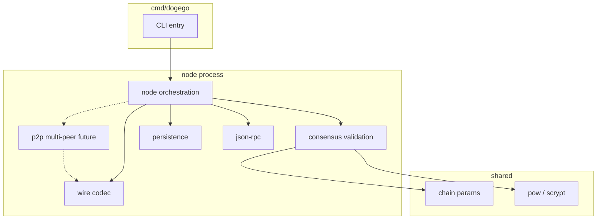

# DogeGo architecture (target)

Planned package layout under `dogego/`. **Phase 0-7 MVPs** below are partially implemented; full Core parity is still out of scope for the marked “future” rows.

## Package roles

| Package | Responsibility |
|---------|----------------|
| `chain/` | `Network` enum, `Params` (magic, ports, genesis, seeds, checkpoints). **Map:** [CHAIN_PARAMETERS.md](CHAIN_PARAMETERS.md), package [README](../chain/README.md). |
| `pow/` | Header hashing, Dogecoin scrypt, compact difficulty. |
| `primitives/` | Non-auxpow `BlockHeader` encode/decode. |
| `wire/` | P2P frame, `version`, compact size, `getheaders` / `headers`, `getdata` encode, **BIP152** `cmpctblock` / `getblocktxn` / `blocktxn`, **block parse** (`ParseBlock`, merkle check), txs (`ReadTx`). |
| `p2p/` | DNS/fixed peer discovery and addr ordering; multi-peer IBD lives in `node/`. |
| `consensus/` | Header/block validation; script verify; **`-assumevalid`** fast path (`assumevalid.go`). |
| `store/` | Header journal (`headers/seg/` or legacy `headers.bin`); raw blocks `rawblocks/`; optional Core `blocks/` + `chainstate/`; UTXO cache. |
| `mempool/` | In-memory pool + relay policy. |
| `rpc/` | HTTP JSON-RPC subset + `dogego_*` diagnostics. |
| `node/` | Multi-peer IBD (block-assist), headers-first sync, `ConnectBlock` / UTXO catch-up, web UI `/api/summary`. |

## Design rules

1. **Core is normative** - when behavior differs, fix DogeGo or document a deliberate experiment.
2. **Test with vectors** - prefer `src/test/*` and `qa/rpc-tests` data over hand-rolled examples.
3. **No silent consensus shortcuts** - “lite” modes must be explicit flags, never default.
