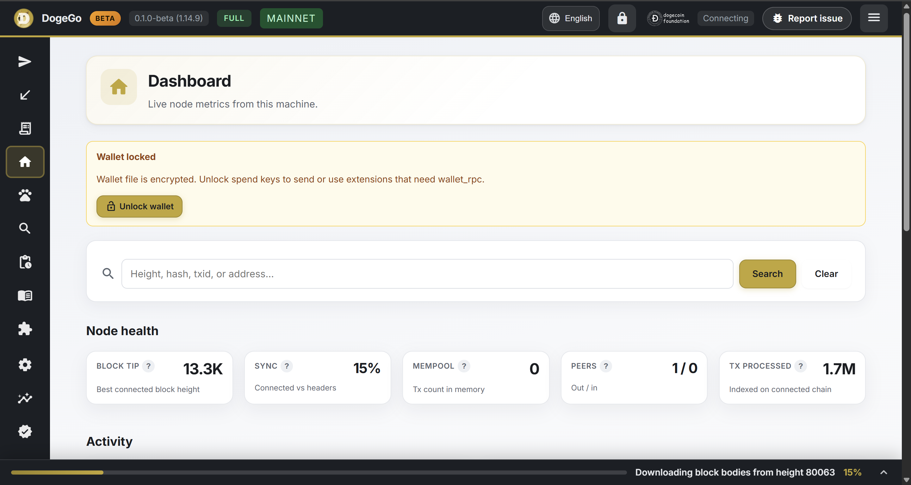

# DogeGo

<p align="center">
  
</p>

<p align="center">
  <strong>Much Faster Full Dogecoin Node</strong><br />
  Open-source Dogecoin full node in Go, with a built-in web dashboard, BlockStep explorer, and Core-compatible JSON-RPC.
</p>

| | |
|---|---|
| **Website** | [dogego.org](https://dogego.org) - static site in [`docs/`](docs/) |
| **App source** | [`DogeGo/`](DogeGo/) - Go module (`go.mod`), binaries, operator docs |
| **DIPs** | [`DogeGo/DIPs/`](DogeGo/DIPs/) - Dogecoin Proposals (BIPs as implemented in DogeGo) |
| **Extensions** | [`DogeGo/extensions/catalog/`](DogeGo/extensions/catalog/) - optional L2 / tooling packages |
| **Releases** | [GitHub Releases](https://github.com/qlpqlp/dogego/releases) |
| **DogeBox PUP** | [`pup/`](pup/) + root [`dogebox.json`](dogebox.json) - install from this GitHub source on [DogeBox](https://github.com/qlpqlp/silly-pups/) |
| **Issues** | [Report a bug or idea](https://github.com/qlpqlp/dogego/issues/new) (also **Report issue** in the WebUI top bar) |
| **Upstream reference** | [Dogecoin Core](https://github.com/dogecoin/dogecoin) - consensus baseline |

**Protocol:** DogeGo follows Dogecoin Core mainnet consensus (see `DogeGo/ROADMAP.md` **Dogecoin protocol lock**). Gaps and intentional differences: `DogeGo/docs/CORE_PARITY_GAPS.md`, `DogeGo/docs/INTENTIONAL_DIFFERENCES.md`.

**Reboot testnet discovery:** new testnet nodes query DNS seed [`seed.dogego.org`](https://seed.dogego.org) **first** (a DogeBox running a public DogeGo full node, so fresh installs find peers quickly), then Core fixed seeds. Details: `DogeGo/docs/CHAIN_PARAMETERS.md`.

---

## Table of contents

1. [Repository layout](#repository-layout)
2. [Build DogeGo](#build-dogego)
3. [Build the website (dogego.org)](#build-the-website-dogegoorg)
4. [Build extensions](#build-extensions)
5. [DIPs (Dogecoin Proposals)](#dips-dogecoin-proposals)
6. [Translations (website + WebUI + extensions)](#translations)
7. [Contributing & pull requests](#contributing--pull-requests)
8. [Architecture](#dogego-architecture-much-faster-full-dogecoin-node)
9. [Automatic updates](#automatic-updates)
10. [Roadmap](#roadmap)
11. [License](#license)

---

## Repository layout

```
dogego/                             ← this repo (website + app)
├── .github/workflows/
│   ├── dogego.yml                  ← offline CI gate (+ optional live jobs)
│   ├── extensions.yml              ← build extension zips + refresh catalog.json
│   ├── release.yml                 ← tagged release binaries
│   └── pages.yml                   ← deploy docs/ → GitHub Pages
├── dogebox.json                    ← DogeBox pup source catalog
├── pup/                            ← DogeGo PUP (manifest + Nix build + logo)
│   ├── manifest.json
│   ├── pup.nix                     ← fetchgit this repo, build DogeGo/
│   ├── logo.png
│   └── README.md
├── docs/                           ← dogego.org (GitHub Pages)
│   ├── index.html                  Landing page
│   ├── css/  js/  assets/
│   ├── locales/                    Website i18n JSON (+ .js bundles)
│   ├── scripts/build-locales.js    Regenerate locale bundles
│   ├── CNAME                       dogego.org
│   └── robots.txt / sitemap.xml
├── DogeGo/                         ← Go module root (the node)
│   ├── cmd/dogego/                 CLI entry
│   ├── node/  chain/  consensus/   Sync, params, validation
│   ├── store/  mempool/  p2p/      Persistence, policy, peers
│   ├── rpc/  wallet/  ui/          JSON-RPC, HD wallet, dashboard
│   ├── DIPs/                       Dogecoin Proposals (BIP catalog)
│   ├── extensions/                 Extension host + official catalog
│   │   └── catalog/                doginals, zkl2, bbpow, examples…
│   │       └── catalog.json        Remote catalog (version + sha256)
│   ├── docs/                       Operator / integrator markdown
│   ├── scripts/                    Cert gates + build_extensions_catalog.*
│   ├── ROADMAP.md
│   └── go.mod
└── README.md                       ← you are here
```

---

## Build DogeGo

Requires [Go 1.22+](https://go.dev/dl/). All app builds run from **`DogeGo/`** (Go module root).

### Windows

```powershell
git clone https://github.com/qlpqlp/dogego.git
cd dogego\DogeGo
.\build.ps1
# or: go build -o dogego.exe .\cmd\dogego
.\dogego.exe
```

### Linux / macOS / BSD

```bash
git clone https://github.com/qlpqlp/dogego.git
cd dogego/DogeGo
go build -o dogego ./cmd/dogego
./dogego
```

### Cross-compile

```bash
cd DogeGo
GOOS=windows GOARCH=amd64 go build -o dogego.exe ./cmd/dogego
GOOS=linux   GOARCH=arm64 go build -o dogego ./cmd/dogego
GOOS=darwin  GOARCH=arm64 go build -o dogego ./cmd/dogego
```

**First run** opens the setup wizard. Dashboard: **http://localhost:2013/**.

### Offline certification

```bash
cd DogeGo
./dogego cert offline
./dogego cert wallet-import
./dogego cert wallet-migration
# or: bash scripts/ci_offline_gate.sh
```

---

## Build the website (dogego.org)

The marketing site is static HTML/CSS/JS under [`docs/`](docs/). Public documentation (same guides as the in-app Docs tab, plus the Bitcoin white paper) is at [`docs/guide/`](docs/guide/) → [dogego.org/guide/](https://dogego.org/guide/).

### Local preview

```bash
# From repo root
node docs/scripts/sync-guide-md.js   # refresh docs/md from DogeGo/docs
node docs/scripts/build-locales.js
npx serve docs
# → http://localhost:3000  and  http://localhost:3000/guide/
```

Opening `docs/index.html` via `file://` works for English (locale `.js` bundles). The Docs guide also works on `file://` via `guide/manifest.js` + `guide/content-bundle.js` (regenerated by `sync-guide-md.js`). HTTP preview is still preferred.

### Locales

```bash
# Edit docs/locales/*.json then regenerate file:// bundles:
node docs/scripts/build-locales.js
# Optional key sync helper:
node docs/scripts/sync-locale-keys.js
```

### Deploy

Push to `main`. Workflow [`.github/workflows/pages.yml`](.github/workflows/pages.yml) syncs markdown into `docs/md/`, rebuilds locale bundles, and publishes `docs/` to GitHub Pages. Custom domain: `docs/CNAME` → `dogego.org`.

---

## Build extensions

Official packages live in [`DogeGo/extensions/catalog/`](DogeGo/extensions/catalog/). Authoring: `AUTHORING.md`, packaging: `BUILDING.md`.

### One package (example: Doginals)

```powershell
cd DogeGo\extensions\catalog\doginals
.\build.ps1
# → dist/doginals.zip + sha256 printed
```

```bash
cd DogeGo/extensions/catalog/zkl2
./build.sh          # or ./build-universal.sh
```

### All catalog packages (CI mirror)

```bash
cd DogeGo
bash scripts/build_extensions_catalog.sh
# Windows (if bash available):
.\scripts\build_extensions_catalog.ps1
```

This rebuilds zips under each package `dist/` and refreshes hashes / `download_url` in `extensions/catalog/catalog.json`.

### How DogeGo discovers catalog updates

1. The node fetches `catalog.json` from GitHub raw (default URL in `extensions/catalog.go`).
2. Each catalog row includes `version`, `download_url` / `downloads`, and `sha256`.
3. The WebUI compares **installed** vs **catalog** semver. When newer, cards show **Update available**, the Extensions sidebar shows a **badge**, and an **Update** button re-fetches the zip.
4. **Manual zip install** (Extensions → Install zip) also replaces the package while **preserving** `extensions/<id>/data/` (databases + settings).
5. CI workflow [`.github/workflows/extensions.yml`](.github/workflows/extensions.yml) builds zips on catalog changes and commits hash updates on `main` so nodes can detect new versions.

---

## DIPs (Dogecoin Proposals)

[`DogeGo/DIPs/`](DogeGo/DIPs/) catalogs Bitcoin Improvement Proposals (**BIPs**) as they apply to Dogecoin / DogeGo, plus overlay proposals (e.g. DIP-3869 for ZK L2 proofs).

| In repo | In WebUI |
|---------|----------|
| `DIPs/README.md` index + `dip-NNNN.md` notes | **Docs → DIPs** section with modern cards (number + title + status) |
| Embedded at build time (`package dips`) | `GET /api/dips` + markdown viewer |

### Help implement or document a DIP / BIP

1. Confirm Core semantics in Dogecoin Core / BIP text.
2. Prefer matching Core; document intentional differences in `docs/INTENTIONAL_DIFFERENCES.md`.
3. Add or update `DogeGo/DIPs/dip-NNNN.md` with:
   - `# DIP-NNNN: Title`
   - `**Status:**` `implemented` | `partial` | `present-disabled` | `extension`
   - `**BIP:**` and `**Summary:**` lines
4. Link the row in `DIPs/README.md`.
5. Add tests + ROADMAP / `CORE_PARITY_GAPS.md` checkboxes as needed.
6. Open a PR (see below).

---

## Translations

### Website (`docs/locales/`)

| Locale | File |
|--------|------|
| English | `docs/locales/en.json` |
| Français | `docs/locales/fr.json` |
| Português (PT) | `docs/locales/pt-PT.json` |
| Deutsch | `docs/locales/de.json` |
| 中文 | `docs/locales/zh.json` |
| 日本語 | `docs/locales/ja.json` |

1. Copy keys from `en.json` into your locale file (or run `sync-locale-keys.js`).
2. Translate values only; keep HTML fragments intact where `*-html` keys exist.
3. Run `node docs/scripts/build-locales.js`.
4. Preview with `npx serve docs` and switch language in the site UI.

### DogeGo WebUI (`DogeGo/ui/static/locales/`)

Same language set. Edit `en.json` first for new strings, then other locales. Partial overlays live under `locales/gaps/`. The dashboard loads `/locales/{code}.json` via `ui/static/i18n.js`.

### Extensions

Extension **UI panels are host-rendered JSON** (no injected HTML). User-facing strings in panel JSON / docs markdown should stay English or provide parallel `docs/` translations in the extension package. Prefer short labels; avoid hard-coding locale in Go when the host can show docs from `docs_path`.

---

## Contributing & pull requests

### Before you start

- Read [`DogeGo/docs/CONTRIBUTING.md`](DogeGo/docs/CONTRIBUTING.md) and [`DogeGo/docs/DEVELOPER_GUIDE.md`](DogeGo/docs/DEVELOPER_GUIDE.md).
- **Mainnet consensus is locked** to Dogecoin Core - no protocol forks in PRs without an explicit design doc and roadmap entry.

### Workflow

1. Fork + branch from `main` (`feat/…`, `fix/…`, `docs/…`).
2. Make focused changes (one concern per PR when possible).
3. Add / update tests under the touched package.
4. Update docs: `docs/*.md`, DIPs, ROADMAP checkboxes, website copy if user-facing.
5. Run offline gate locally:

   ```bash
   cd DogeGo
   bash scripts/ci_offline_gate.sh
   # or: go test ./...
   ```

6. Push and open a PR against `qlpqlp/dogego` with:
   - **What** changed and **why**
   - Test plan (commands / UI steps)
   - DIP / BIP references when relevant
7. CI must pass (`.github/workflows/dogego.yml`). Extension packaging PRs also exercise `.github/workflows/extensions.yml`.

### Good first contributions

- Locale strings (website or WebUI)
- DIP documentation polish
- Extension docs / examples
- RPC cookbook / operator runbook clarity
- Tests for existing behavior

### Report bugs

- WebUI: top-bar **Report issue** (pre-fills DogeGo version + current section)
- Or open https://github.com/qlpqlp/dogego/issues/new manually
- CLI context: mention `dogego version` output and the command you ran

---

## DogeGo architecture (Much Faster Full Dogecoin Node)

DogeGo is a **single-process Go full node**: P2P sync, consensus validation, persistence, JSON-RPC, and a loopback web UI in one binary. Storage uses a **Go-native layout** (`headers.bin` / segment journals, `rawblocks/`, optional indexes) - not interchangeable with Core’s `blocks/` + `chainstate/`.

```
┌─────────────────────────────────────────────────────────────┐
│  cmd/dogego  →  node/  (orchestration, IBD, peer manager)   │
├──────────────┬──────────────┬──────────────┬────────────────┤
│  wire/ p2p/  │  consensus/  │  store/      │  rpc/          │
│  P2P codec   │  validation  │  persistence │  JSON-RPC      │
├──────────────┴──────────────┴──────────────┴────────────────┤
│  ui/  - dashboard, BlockStep explorer, setup wizard, Docs    │
│  wallet/  - HD wallet (mainnet + reboot testnet)             │
│  mempool/  - relay policy ·  analytics/ indexer (sidecar)  │
│  DIPs/ + extensions/  - proposals catalog + optional L2     │
├─────────────────────────────────────────────────────────────┤
│  chain/ + pow/  - network params, Dogecoin scrypt PoW        │
└─────────────────────────────────────────────────────────────┘
```

| Package | Role |
|---------|------|
| `node/` | Headers-first IBD, block-assist, multi-peer relay, web `/api/summary` |
| `consensus/` | Header/block checks, script VM, mempool policy vectors |
| `store/` | Header journal, raw blocks (bundled/zstd), UTXO cache |
| `rpc/` | Core-shaped JSON-RPC subset + operator `dogego_*` methods |
| `ui/` | Loopback dashboard, BlockStep, embedded docs + DIPs |
| `wallet/` | BIP44 HD wallet, encryption, PSBT subset |
| `DIPs/` | Dogecoin Proposals (BIP tracking) |
| `extensions/` | Secure subprocess/wasm host + catalog updates |

Deep dive: [`DogeGo/docs/ARCHITECTURE.md`](DogeGo/docs/ARCHITECTURE.md) · [`DogeGo/docs/OVERVIEW.md`](DogeGo/docs/OVERVIEW.md).

---

## Automatic updates

### Node binary

The running node polls **GitHub Releases** on `github.com/qlpqlp/dogego` for newer semver tags. Overview / Settings banners offer download or apply when a matching asset exists.

- Disable: `DOGEGO_NO_UPDATE_CHECK=1`
- State: `<datadir>/update_check.json`

### Extensions

Catalog-driven (see [Build extensions](#build-extensions)). Update preserves `data/`; uninstall can remove or keep data depending on API flags.

---

## Roadmap

Full checklist: [`DogeGo/ROADMAP.md`](DogeGo/ROADMAP.md). Summary:

| Phase | Focus | Status (high level) |
|-------|--------|---------------------|
| **0-5** | Params, P2P, sync, consensus, store | MVP |
| **6-7** | Mempool, RPC | MVP subset |
| **8-9** | Web UI, security | MVP |
| **10-11** | PQ commitments, wallet depth | Partial / MVP |
| **12** | Documentation & integrator UX | Ongoing |

**Production gate:** [`DogeGo/docs/STANDALONE_FULLNODE_ACCEPTANCE.md`](DogeGo/docs/STANDALONE_FULLNODE_ACCEPTANCE.md). Until that matrix is complete, prefer **Dogecoin Core** for exchange-grade or `wallet.dat` deployments.

---

## License

DogeGo is [MIT licensed](DogeGo/LICENSE). Copyright (c) 2026 Paulo Vidal and Dogecoin Foundation. Implementation is informed by [Dogecoin Core](https://github.com/dogecoin/dogecoin) and [Bitcoin Core](https://github.com/bitcoin/bitcoin) (both MIT).
